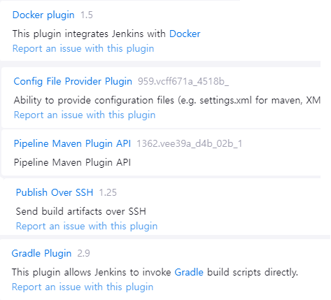
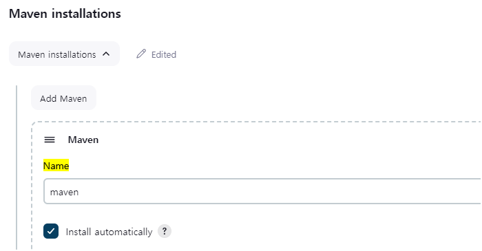
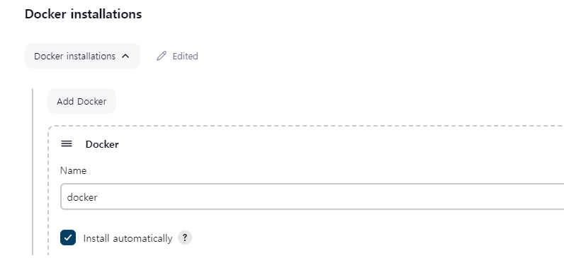
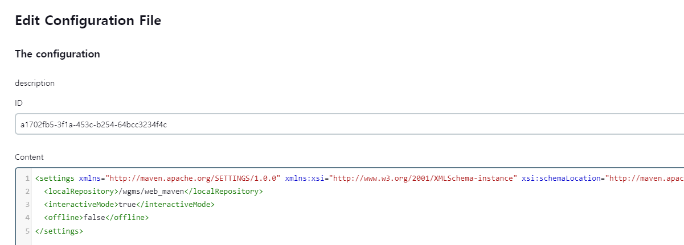
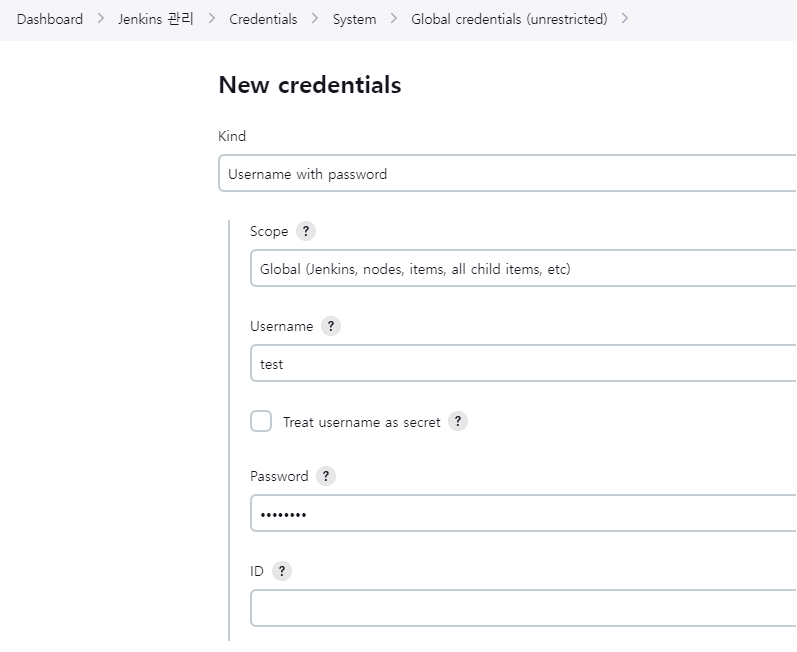

FORMAT: 1A
HOST: http://jenkins.golfzoncounty.com/

# **Jenkins CI/CD**
>   - Version 2.436

Jenkins를 통한 CI/CD 구축한 과정을 정리 공유 해보고자 합니다.
우선 이번 프로젝트에서 구축하려는 CI/CD 구조는 다음과 같습니다.

1. Git Lab 배포 브런치에 Push/Merge
2. Jenkins(docker container)에서 빌드 및 배포
    + git checkout
    + 프로젝트 빌드
    + war, jar 파일 도커 이미지 빌드
    + ssh을 통한 도커 이미지 파일 전송
    + 배포 서버에서 도커 컨테이너 생성 및 실행
    + 젠킨스 리소스 정리

Jenkins의 환경 설정부터 시작하여 CI/CD 구축 과정을 살펴보겠습니다.

   

## jenkins 설치

#### 1. 도커 설치 (Deploy 서버 환경에 맞게 설치, 예시는 AWS AML2)
    
        $ sudo yum install docker -y 
        $ sudo service docker start // 도커 실행
        $ sudo usermod -aG docker ec2-user // 필요에 따라 도커 권한 부여

#### 2. 컨테이너내 젠킨스 홈 폴더와 마운트 시킬 디렉토리 생성 및 권한 부여

      mkdir -p /docker/jenkins && chmod 666 /docker/jenkins

#### 3. 젠킨스 컨테이너 생성

        $ docker run -d --name jenkins -p 8080:8080 -v /docker/jenkins:/var/jenkins_home -v /usr/bin/docker:/usr/bin/docker -v /var/run/docker.sock:/var/run/docker.sock -u root [이미지 네임 or ID]
- /docker/jenkins:/var/jenkins_home
    - 젠킨스 컨테이너의 설정을 호스트 서버와 공유함으로써, 컨테이너가 삭제되는 경우에도 설정을 유지할수 있게 해줌.
- -v /usr/bin/docker:/usr/bin/docker -v /var/run/docker.sock:/var/run/docker.sock
    - 젠킨스 컨테이너에서도 호스트 서버의 도커를 사용하기 위한 바인딩.
- -p 8080:8080
    - 젠킨스의 defaul port 인 8080 을 호스트 서버와 매핑. 
- 현재 구성된 젠킨스의 경우 **jenkins/jenkins:lts** 이미지를 기반으로 구성.

   

##  **젠킨스 구성**

+ **젠킨스 plugin 설치**

    1. jenkins 관리 > Plugins > Available Plugins > Docker plugin 설치
    2. jenkins 관리 > Plugins > Available Plugins > Publish Over SSH 설치
    3. jenkins 관리 > Plugins > Available Plugins > Config File Provider Plugin 설치
    4. jenkins 관리 > Plugins > Available Plugins > pipeline maven integration
    5. jenkins 관리 > Plugins > Available Plugins > Gradle Plugin
        -  젠킨스 버전에 따라 디폴트로 설치 되어 있을 수 있음  
        > 

  

## **Pipeline 사전 설정**
#### 1. jenkins 관리 > Systems > Publish over SSH (plugin 설치) > 배포할 서버 private key 세팅
  - **name**값 파이프라인에서 사용
> 

 

#### 2. jenkins 관리 > Tools > Gradle installations > 7.6 버전 설정
         - **name**값 파이프라인에서 사용
>  

 

#### 3. jenkins 관리 > Tools > Maven installations > 3 버전 설정
- **name**값 파이프라인에서 사용
>  

 

#### 4. jenkins 관리 > Tools > Docker installations (plugin 설치) > 설정
- **name**값 파이프라인에서 사용 
>  

 

#### 5. jenkins 관리 > Managed files(plugin 설치) > Add a new config  > Maven settings.xml > 하기 코드 입력 및 생성

       <settings xmlns="http://maven.apache.org/SETTINGS/1.0.0" xmlns:xsi="http://www.w3.org/2001/XMLSchema-instance"
                 xsi:schemaLocation="http://maven.apache.org/SETTINGS/1.0.0 http://maven.apache.org/xsd/settings-1.0.0.xsd">
           <localRepository>{컨테이너 내 메이븐 로컬 레포지토리 경로}</localRepository>
           <interactiveMode>true</interactiveMode>
           <offline>false</offline>
       </settings>
- 현재 카운티 젠킨스 서버내 로컬 경로는 컨테이너 내 /wgms/web_maven에 위치
- **ID**값 파이프라인에서 사용
>   

 

#### 6. jenkins 관리 > Credentials >  add Credentials (프로젝트별 Git 계정 등록)
- **ID**값 파이프라인에서 사용
>  

   

## pipeline 구성

new item > Pipeline 생성 > pipeline 스크립트 작성

#### Pipeline 변수 설정 

        def dockerImageName = "smartfield-api" // 이미지 빌드할 이름
        def tagVersion = "0.0.1" // 이미지 빌드시 tag
        
        def targetServer1 = "QA_WGMS_API01" // ssh 설정한 name값
        def targetServer2 = "QA_WGMS_API02" // ssh 설정한 name값
                
        def branch = "deploy-qa" // 배포할 branch
        def gitCredentials = "github-signin" // jenkins credentials 설정한 id 값
        def giturl = "https://github.com/golfzone/smartfield-api.git"  //git http

#### 0. stage - Tool 정의

           agent any
           tools {
                 gradle 'gradle'       // jenkins > tools > gradle name 값
                 dockerTool 'docker'   // jenkins > tools > docker name 값
             }

#### 1. stage - 소스 최신화
- 배포하려는 git branch로 git check out

         stage('Checkout Git Branch') {
             steps {
                git branch: '{branch}', credentialsId: '{설정한 Credential Id 값}', url: '{git http url}'
             }
         }

#### 2. stage - 프로젝트 빌드
    - maven 프로젝트 빌드시 **pipeline maven** , **Config File Provider** 필요

            stage('gardle Build') {
                steps {
                    sh 'chmod +x gradlew'
                    sh './gradlew bootjar'
                            or
                   withMaven(maven: 'maven', mavenSettingsConfig: 'a1702fb5-3f1a-453c-b254-64bcc3234f4c') { 
                       sh "mvn clean install "
                   } 
            }

#### 3. stage - 도커 이미지 빌드
    - 도커파일 프로젝트 내 존재

          stage('Docker Image Build') {
              steps {
                 docker rmi -f {이미지명}  || true // 이미지 초기화
                 docker build --tag {이미지명} . // 이미지 빌드 Dockerfile 소스 코드 최상단에 위치
                 rm -f ./*  // 파일 초기화
                 docker save -o {파일명} {이미지명}   //이미지 파일 저장
              }
          }

#### 4. stage - Deploy
- ssh 파일 전송 및 각 서버 도커 이미지 교체 (publish over ssh 플러그인 사용)

        configName: "{publish over ssh 설정한 값}"
- execCommand :

        "docker stop {이미지 명} || true //기존 이미지 스탑 
        docker system prune -a -f // 기존 도커 리소스 정리
        cd /app && docker load -i {전송한 파일명}
        docker run -i -d -p {호스트 포트}:{컨테이rm -f ${dockerImageName}.tar너 포트} --name {생성할 컨테이너명} {사용할 이미지명}
        rm -f {전송한 파일} // 파일 정리"

**5. stage - 리소스 정리**
- 배포에 사용된 젠킨스 리소스 정리

        stage('Clean') {
            steps {
                docker rmi -f {이미지명} || true // 이미지 정리
                rm -rf ./*  // 파일 정리
            }
        }

  

## 특이사항
+ 프로젝트 소스 최상단의 도커파일로 이미지 빌드함, 각 배포에 맞게 수정 필요
+ ERP의경우 Gradle 프로젝트로 구성
+ WEB의 경우 Maven 프로젝트로 구성
    - 빌드시 로컬 레포지토리 필요(2023-12-29 : 카운티 jenkins 컨테이너 > /wgms/web_maven)
+ 계속 추가 예정

  

---

 

> # 파이프라인 Sample

### wgms erp api
        def buildName = "smartfield-api-0.0.1-SNAPSHOT.jar"
        def dockerImageName = "smartfield-api"
        def tagVersion = "0.0.1"
        
        def targetServer1 = "QA_WGMS_API01"
        def targetServer2 = "QA_WGMS_API02"
        
        def gradleProfile = "qa"
        
        // def branch = "master"
        // def gitCredentials = "gitlab-signin"
        // def giturl = "http://172.19.156.10:8088/web-gms/wgms-api.git"
        
        def branch = "deploy-qa"
        def gitCredentials = "github-signin"
        def giturl = "https://github.com/golfzone/smartfield-api.git"
        
        
        pipeline {
            agent any
                tools {
                    gradle 'gradle'
                    dockerTool 'docker'
                }
            stages {
        
                stage('Checkout Git Branch') {
                    steps {
                        git branch: branch, credentialsId: gitCredentials, url: giturl
                    }
                    post {
                        failure {
                            echo 'Repository clone failure !'
                        }
                        success {
                            echo 'Repository clone success !'
                        }
                    }
                }
        
                stage('gardle Build') {
                    steps {
                        sh 'chmod +x gradlew'
                        sh './gradlew bootjar'
                    }
                    post {
                        failure {
                            echo 'Gradle build failure !'
                        }
                        success {
                            echo 'Gradle build success !'
                        }
                    }
                }
        
                stage('Docker Image Build') {
                    steps {
                        sh "docker rmi -f ${dockerImageName}:${tagVersion} || true"
                        sh "docker build --tag ${dockerImageName}:${tagVersion} . --build-arg PROFILE=${gradleProfile} "
                        sh "rm -f ./*"
                        sh "docker save -o ${dockerImageName}.tar ${dockerImageName}"
                    }
                    post {
                        failure {
                            echo 'Docker image build failure !'
                        }
                        success {
                            echo 'Docker image build success !'
                        }
                    }
                }
                stage('Deploy Server 01') {
                    steps([$class: 'BapSshPromotionPublisherPlugin']) {
                        sshPublisher(
                            continueOnError: true, failOnError: false,
                            publishers: [
                                sshPublisherDesc(
                                    configName: "${targetServer1}",//Jenkins 시스템 정보에 사전 입력한 서버 ID
                                    verbose: true,
                                    transfers: [
                                        sshTransfer(
                                            sourceFiles: "${dockerImageName}.tar", //전송할 파일
                                            removePrefix: "", //파일에서 삭제할 경로가 있다면 작성
                                            remoteDirectory: "/app", //배포할 위치
                                            execCommand: 
                                                "docker stop ${dockerImageName} || true && docker system prune -a -f && cd app && docker load -i ${dockerImageName}.tar && docker run -i -d -p 8080:80 -e TZ=Asia/Seoul --name ${dockerImageName} ${dockerImageName}:0.0.1 && docker ps && rm -f ${dockerImageName}.tar"
                                            )
                                    ]
                                )
                            ]
                        )
                    }
                }
                stage('Deploy Server 02') {
                    steps([$class: 'BapSshPromotionPublisherPlugin']) {
                        sshPublisher(
                            continueOnError: true, failOnError: false,
                            publishers: [
                                sshPublisherDesc(
                                    configName: "${targetServer2}",//Jenkins 시스템 정보에 사전 입력한 서버 ID
                                    verbose: true,
                                    transfers: [
                                        sshTransfer(
                                            sourceFiles: "${dockerImageName}.tar", //전송할 파일
                                            removePrefix: "", //파일에서 삭제할 경로가 있다면 작성
                                            remoteDirectory: "/app", //배포할 위치
                                            execCommand: 
                                                "docker stop ${dockerImageName} || true && docker system prune -a -f && cd app && docker load -i ${dockerImageName}.tar && docker run -i -d -p 8080:80 -e TZ=Asia/Seoul --name ${dockerImageName} ${dockerImageName}:0.0.1 && docker ps && rm -f ${dockerImageName}.tar"
                                            )
                                    ]
                                )
                            ]
                        )
                    }
                }
                stage('Clean') {
                    steps {
                        sh "docker rmi -f ${dockerImageName}:${tagVersion} || true"
                        sh 'rm -rf ./*'
                        sh 'rm -rf ./.git'
                    }
                    post {
                        failure {
                            echo 'Docker image build failure !'
                        }
                        success {
                            echo 'Docker image build success !'
                        }
                    }
                }
                
            }
        }

### wgms erp web

        def buildName = "smartfield-front-0.0.1-SNAPSHOT.jar"
        def dockerImageName = "smartfield-front"
        def tagVersion = "0.0.1"
        
        def targetServer1 = "QA_WGMS_WEB01"
        def targetServer2 = "QA_WGMS_WEB02"
        
        def gradleProfile = "qa"
        
        // def branch = "master"
        // def gitCredentials = "gitlab-signin"
        // def giturl = "http://172.19.156.10:8088/web-gms/wgms-front.git"
        
        def branch = "deploy-qa"
        def gitCredentials = "github-signin"
        def giturl = "https://github.com/golfzone/smartfield-front.git"
        
        pipeline {
            agent any
                tools {
                    gradle 'gradle'
                    dockerTool 'docker'
                }
            stages {
        
                stage('Checkout Git Branch') {
                    steps {
                        git branch: branch, credentialsId: gitCredentials, url: giturl
                    }
                    post {
                        failure {
                            echo 'Repository clone failure !'
                        }
                        success {
                            echo 'Repository clone success !'
                        }
                    }
                }
        
                stage('gardle Build') {
                    steps {
                        sh 'chmod +x gradlew'
                        sh './gradlew bootjar'
                    }
                    post {
                        failure {
                            echo 'Gradle build failure !'
                        }
                        success {
                            echo 'Gradle build success !'
                        }
                    }
                }
        
                stage('Docker Image Build') {
                    steps {
                        sh "docker rmi -f ${dockerImageName}:${tagVersion} || true"
                        sh "docker build --tag ${dockerImageName}:${tagVersion} . --build-arg PROFILE=${gradleProfile} "
                        sh "rm -f ./*"
                        sh "docker save -o ${dockerImageName}.tar ${dockerImageName}"
                    }
                    post {
                        failure {
                            echo 'Docker image build failure !'
                        }
                        success {
                            echo 'Docker image build success !'
                        }
                    }
                }
                stage('Deploy Server 01') {
                    steps([$class: 'BapSshPromotionPublisherPlugin']) {
                        sshPublisher(
                            continueOnError: true, failOnError: false,
                            publishers: [
                                sshPublisherDesc(
                                    configName: "${targetServer1}",//Jenkins 시스템 정보에 사전 입력한 서버 ID
                                    verbose: true,
                                    transfers: [
                                        sshTransfer(
                                            sourceFiles: "${dockerImageName}.tar", //전송할 파일
                                            removePrefix: "", //파일에서 삭제할 경로가 있다면 작성
                                            remoteDirectory: "/app", //배포할 위치
                                            execCommand: 
                                                "docker stop ${dockerImageName} || true && docker system prune -a -f && cd app && docker load -i ${dockerImageName}.tar && docker run -i -d -p 8080:80 -e TZ=Asia/Seoul --name ${dockerImageName} ${dockerImageName}:0.0.1 && docker ps && rm -f ${dockerImageName}.tar"
                                            )
                                    ]
                                )
                            ]
                        )
                    }
                }
                stage('Deploy Server 02') {
                    steps([$class: 'BapSshPromotionPublisherPlugin']) {
                        sshPublisher(
                            continueOnError: true, failOnError: false,
                            publishers: [
                                sshPublisherDesc(
                                    configName: "${targetServer2}",//Jenkins 시스템 정보에 사전 입력한 서버 ID
                                    verbose: true,
                                    transfers: [
                                        sshTransfer(
                                            sourceFiles: "${dockerImageName}.tar", //전송할 파일
                                            removePrefix: "", //파일에서 삭제할 경로가 있다면 작성
                                            remoteDirectory: "/app", //배포할 위치
                                            execCommand: 
                                                "docker stop ${dockerImageName} || true && docker system prune -a -f && cd app && docker load -i ${dockerImageName}.tar && docker run -i -d -p 8080:80 -e TZ=Asia/Seoul --name ${dockerImageName} ${dockerImageName}:0.0.1 && docker ps && rm -f ${dockerImageName}.tar"
                                            )
                                    ]
                                )
                            ]
                        )
                    }
                }
                stage('Clean') {
                    steps {
                        sh "docker rmi -f ${dockerImageName}:${tagVersion} || true"
                        sh 'rm -rf ./*'
                        sh 'rm -rf ./.git'
                    }
                    post {
                        failure {
                            echo 'Docker image build failure !'
                        }
                        success {
                            echo 'Docker image build success !'
                        }
                    }
                }
        
            }
        }

### wgms web

        def buildName = "holeinone-0.0.1-SNAPSHOT.war"
        def dockerImageName = "holeinone"
        def tagVersion = "0.0.1"
        def branch = "master"
        def targetServer = "QA_WGMS_WEB01"
        
        
        pipeline {
            agent any
                tools {
                    dockerTool 'docker'
                }
            stages {
                stage('Checkout Git Branch') {
                    steps {
                        git branch: branch, credentialsId: 'gitlab-signin', url: 'http://172.19.156.10:8088/web-gms/wgms-web.git'
                    }
                    post {
                        failure {
                            echo 'Git checkout failure !'
                        }
                        success {
                            echo 'Git checkout success !'
                        }
                    }
                }
        
                stage('maven Build') {
                    steps {
                        withMaven(maven: 'maven', mavenSettingsConfig: 'a1702fb5-3f1a-453c-b254-64bcc3234f4c') {
                            sh "mvn clean install "
                        }
                        
                        sh "mv ./target/holeInOne-0.0.1-SNAPSHOT.war ./ || true"
                        sh "rm -rf ./src"
                        sh "rm -rf ./target"
                    }
                    post {
                        failure {
                            echo 'maven build failure !'
                        }
                        success {
                            echo 'maven build success !'
                        }
                    }
                }
                
                stage('Docker Image Build') {
                    steps {
                            sh "docker rmi -f ${dockerImageName}:${tagVersion} || true"
                            sh "docker build --tag ${dockerImageName}:${tagVersion} . "
                            sh "rm -f ./*"
                            sh "docker save -o ${dockerImageName}.tar ${dockerImageName}"
                    }
                    post {
                        failure {
                            echo 'Docker image build failure !'
                        }
                        success {
                            echo 'Docker image build success !'
                        }
                    }
                }
                stage('SSH transfer') {
                    steps([$class: 'BapSshPromotionPublisherPlugin']) {
                        sshPublisher(
                            continueOnError: true, failOnError: false,
                            publishers: [
                                sshPublisherDesc(
                                    configName: "${targetServer}",//Jenkins 시스템 정보에 사전 입력한 서버 ID
                                    verbose: true,
                                    transfers: [
                                        sshTransfer(
                                            sourceFiles: "${dockerImageName}.tar", //전송할 파일
                                            removePrefix: "", //파일에서 삭제할 경로가 있다면 작성
                                            remoteDirectory: "/app", //배포할 위치
                                            execCommand: 
                                                "docker stop ${dockerImageName} || true && docker system prune -a -f && cd app && docker load -i ${dockerImageName}.tar && docker run -i -d -p 8030:8080 -e TZ=Asia/Seoul --name ${dockerImageName} ${dockerImageName}:0.0.1 && docker ps && rm -f ${dockerImageName}.tar"
                                            )
                                    ]
                                )
                            ]
                        )
                    }
                }
                stage('Clean') {
                    steps {
                        sh "docker rmi -f ${dockerImageName}:${tagVersion} || true"
                        sh "rm -rf ./*"
                        sh "rm -rf ./.git"
                    }
                    post {
                        failure {
                            echo 'Docker image build failure !'
                        }
                        success {
                            echo 'Docker image build success !'
                        }
                    }
                }
                
            }
        }

Todo
<!--- 배포 트리거 설정(2023-12-18)-->
<!--- 무중단 배포 (2023-12-18)-->
